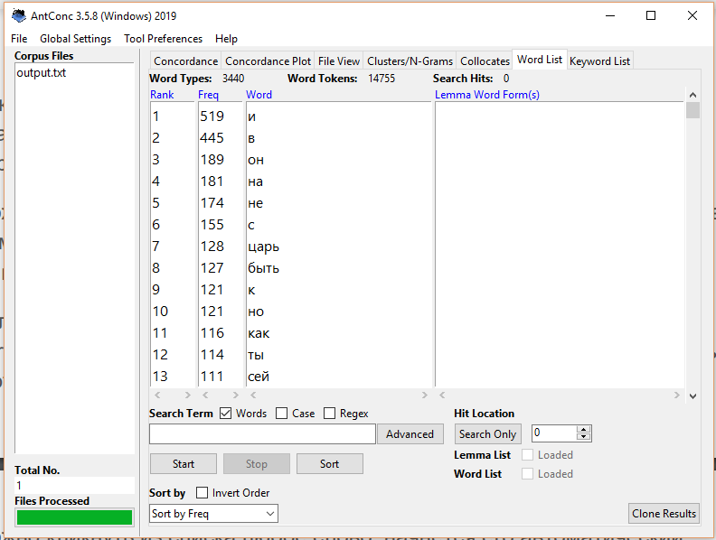

# HW3
1.2 Самые частотные слова

   
1.3+стоплист

1.4.Устаревшие слова и их конкордансы

            
            

1.5.N-grams

1.6.Коллокаты

2.2.
      
1.Поиск показал, что синоним слова "пригожство", "красота", был наиболее употребимым во время написания поэмы "Россиада" М.Херасковым (1770е) и остается теперь.
 

    
2.Наболее употребимым оказалось слово "желать". "Жаждать" и "алкать" (синоним,используемый Херасковым) использовались и используются мало.
     

                
3. Современный синоним слова "перси", "грудь", также более употребим. В НКРЯ даже не удалось найти слово с нужным значением.
                            

На основе сделланных наблюдений, можно предположить, что автор в своем произведении использовал слова устаревшие даже для своего времени для стилизации текста."Россиада" задумывалась как национальная эпическая поэма.

3. ipm 
а) пригожство  0
   красота     1,383
   изящество   0,056
б) желать      4,163
   жаждать     0,187
   алкать      0,046

в) перси   0
   грудь   2,177
3. На мой взляд, использование корпусов, инструментов вроде Antconc помогает подтвердить теории, которые возникают как некоторые ощущения при прочтении текстов. Так, воспользовавшись НКРЯ и Google Ngrams, можно убедиться в том, что автор намерянно выбирает слова мало употребимые, даже для своего времени.
